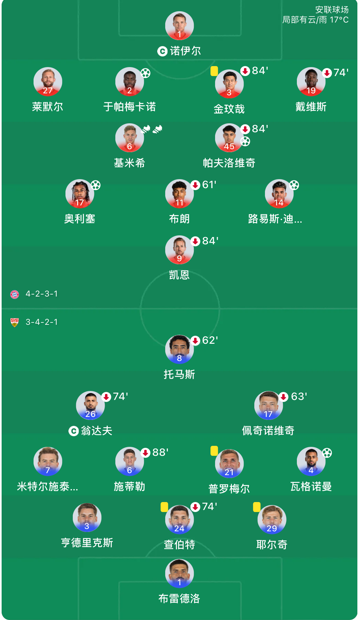
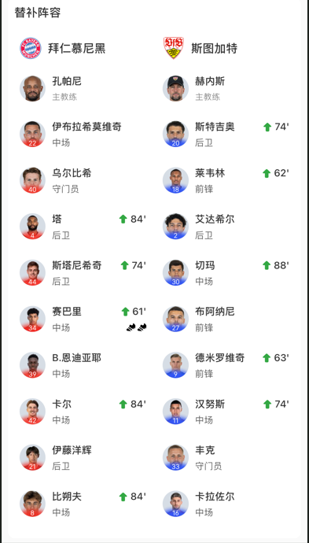
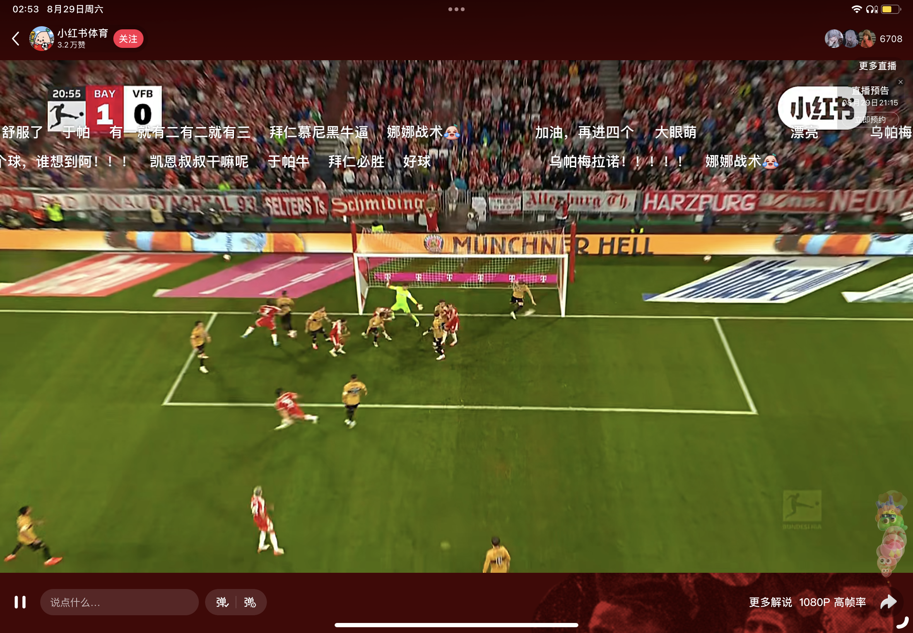

# 德甲联赛第1轮 拜仁慕尼黑-斯图加特（5-1）

这个模块算是第一次做，凭着一些对拜仁的喜爱按照自己喜好做一些复盘。非专业数据分析，完全偏心来的从拜仁的角度分析

## 主要阵容和换人流程

~~xhs的球员证件照真的好笑 每个人都两模两样~~

这一场算是拜仁前场人比较齐的一次，也算是在世界杯夏令营呆得比较久的凯恩、奥利塞、于帕回来初步调整好第一次正式比赛合体。看起来就是很舒适啊

## 一些highlight

首先让我们恭喜本赛季德甲联赛第一个进球的队员——于帕大眼萌

然后也是诞生了凯恩叔叔的庆祝~~神图~~笑话

这个进球来自鸡哥的角球助攻，鸡哥不是区，鸡哥牛

之后的第二个球也是鸡哥的助攻，奥利塞打门

~~中间还有一个斯图加特的进球~~

没过几分钟，斯图加特的球员送了一个乌龙球~~安联的草皮到底是该夸还是该修嘞~~

在61'换人之后，赛巴里助攻泡芙第四个球，之后也是助攻嗲丝一个单刀~~不过这次嗲丝浪费的单刀确实有点多~~

## 夸

我觉得每个人都可以夸夸

1 诺伊尔依旧是稳稳的

2 于帕就是神~~我从世界杯说到现在~~

3 金哥是稳的

27 莱默尔感觉这场跑动范围还蛮大，很积极

19 芳子感觉恢复得不错，很多个很好的防守

6 鸡哥这场真得踢得很好

45 泡芙依旧很乐呵地进了一个球

17 你莉这场mvp说啥了

11 布朗这场还是顶10位的位置，我觉得没有做错就很好了，这5000万还是太值了

14 迪哥你这射门，你看看身后的老凯，帮他刷点助攻吧

9 凯恩叔叔依旧无私，依旧从后踢到前~~这场没有很前了~~

34 赛巴里还是这个身体模板太好了，期待以后的10号位表现

## 最后一点点

这个赛季开场实在是太精彩了，但是我们板凳确实浅

但我还是相信孔帕尼，相信拜仁慕尼黑

这个分类下做一些记录，希望今年能有大结果
