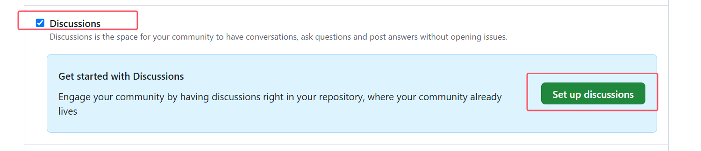
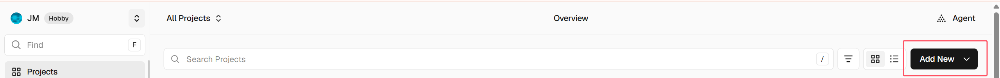
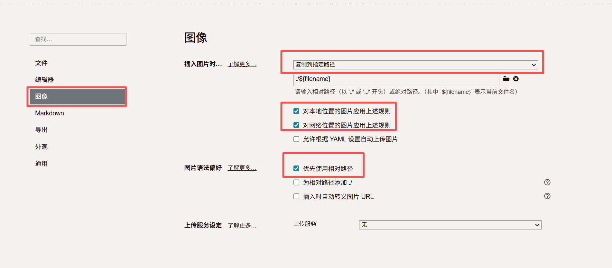

# 从零搭建 Hexo + Butterfly 个人博客

> 本文记录 `JrdnMuetBlog` 从本地初始化到正式上线的完整过程。
>
> 最终实现：**Hexo + Butterfly + GitHub + Vercel + Giscus + 本地搜索 + Typora 写作**。

---

## ✨ 最终效果

整个博客的工作流如下：

```text
Typora
   ↓
Markdown
   ↓
Hexo
   ↓
Butterfly
   ↓
GitHub
   ↓
Vercel
   ↓
正式博客
```

目前已经实现：

- ✅ Butterfly 主题
- ✅ 首页背景与头像
- ✅ 文章封面
- ✅ 分类 / 标签 / About
- ✅ Abbrlink 永久链接
- ✅ GitHub 源码托管
- ✅ Vercel 自动部署
- ✅ Giscus 评论系统
- ✅ 本地全文搜索
- ✅ Typora 写作
- ✅ 文章独立图片目录

---

写在前面：

本来不想做blog但是发现这样可以更好地梳理看过的内容（包括不限于学习上的和爱玩爱看的）所以开始建设这个blog

本人是个懒蛋所以基本上不喜欢从0开始 但是又不太喜欢花里胡哨 喜欢自由度高的东西 所以选择了这套方案

然后想着作为起点来梳理一下整个流程（感谢G老师的帮助让整个搭建的时间大大缩短） 希望可以有帮助 欢迎留言

# 00 · 做些准备

一个check list看下需要有些什么材料 本人是在windows 11上实现的

> [!NOTE]
>
> - vscode
> - Node.js
> - npm
> - git bash
> - Github账号
> - Vercel账号
> - 魔法（能看到我的blog应该就有）

# 01 · 初始化 Hexo

## 安装 Hexo CLI

进入博客工作目录：

```cmd
cd /d D:\Blog
```

安装 Hexo：

```cmd
npm install -g hexo-cli
```

检查版本：

```cmd
hexo version
```

---

## 创建博客

初始化：

```cmd
hexo init JrdnMuetBlog
cd JrdnMuetBlog
npm install
```

首次运行：

```cmd
hexo clean
hexo generate
hexo server
```

浏览器打开：

```text
http://localhost:4000
```

如果能看到 Hexo 默认页面，说明基础环境正常。

---

# 02 · 安装 Butterfly

安装主题：

```cmd
npm install hexo-theme-butterfly
```

安装 Butterfly 需要的渲染器：

```cmd
npm install hexo-renderer-pug hexo-renderer-stylus --save
```

打开：

```text
D:\Blog\JrdnMuetBlog\_config.yml
```

找到：

```yaml
theme: landscape
```

修改为：

```yaml
theme: butterfly
```

然后重新生成：

```cmd
hexo clean
hexo g
hexo s
```

如果页面已经变成 Butterfly 风格，说明安装成功。

---

# 03 · 独立主题配置

不建议直接修改：

```text
node_modules\hexo-theme-butterfly\
```

因为以后升级主题时容易被覆盖。

执行：

```cmd
copy /Y node_modules\hexo-theme-butterfly\_config.yml _config.butterfly.yml
```

新建一个_config.butterfly.yml用来更改

之后两个配置文件分工如下：

| 文件 | 用途 |
| --- | --- |
| `_config.yml` | Hexo 主配置 |
| `_config.butterfly.yml` | Butterfly 外观与功能配置 |

---

# 04 · 基本站点信息

修改 `_config.yml`：

```yaml
title: JrdnMuet Blog
subtitle: ''
description: ''
keywords:
author: JrdnMuet
language: zh-CN
timezone: Asia/Shanghai

theme: butterfly
```

---

# 05 · 首页图片、头像与封面

建立资源目录：

```text
source\img\
```

例如：

```text
source\img\
├─ avatar.jpg
├─ favicon.png
├─ home.jpg
└─ cover-default.jpg
```

---

## 头像

在 `_config.butterfly.yml` 中：

```yaml
avatar:
  img: /img/avatar.jpg
  effect: false
```

---

## Favicon（浏览器标签页图标）

```yaml
favicon: /img/favicon.png
```

---

## 首页背景

```yaml
index_img: /img/home.jpg
```

> [!CAUTION]
>
> Windows 对文件名大小写不敏感，但 Vercel 使用 Linux 环境。
>
> 因此：
>
> ```text
> home.jpg
> Home.jpg
> home.JPG
> ```
>
> 在线上环境中可能被视为不同文件。
>
> 建议统一使用小写文件名。

---

## 默认文章封面

```yaml
cover:
  index_enable: true
  aside_enable: true
  archives_enable: true
  position: both
  default_cover:
    - /img/cover-default.jpg
```

单篇文章也可以在 Front Matter 中单独设置：

```yaml
cover: /img/xxx.jpg
```

---

# 06 · 导航栏

配置：

```yaml
menu:
  首页: / || fas fa-home
  归档: /archives/ || fas fa-archive
  标签: /tags/ || fas fa-tags
  分类: /categories/ || fas fa-folder-open
  关于: /about/ || fas fa-user
```

固定导航栏：

```yaml
nav:
  logo:
  display_title: true
  display_post_title: true
  fixed: true
```

---

# 07 · 标签、分类与 About

创建页面：

```cmd
hexo new page tags
hexo new page categories
hexo new page about
```

---

## 标签页

`source\tags\index.md`

```yaml
---
title: 标签
type: "tags"
---
```

---

## 分类页

`source\categories\index.md`

```yaml
---
title: 分类
type: "categories"
---
```

---

## About 页面

`source\about\index.md`

```markdown
---
title: 关于
---

# JrdnMuet

Welcome to my blog.
```

---

# 08 · 设置文章永久链接

默认 Hexo URL 类似：

```text
/2026/08/28/文章标题/
```

为了获得更加简洁稳定的 URL，安装：

```cmd
npm install hexo-abbrlink --save
```

修改 `_config.yml`：

```yaml
permalink: posts/:abbrlink.html

abbrlink:
  alg: crc32
  rep: hex
  drafts: false
```

之后文章地址类似：

```text
/posts/5b89d90f.html
```

优点：

- URL 更短
- 修改文章标题后 URL 不容易变化
- 更适合长期维护

---

# 09 · 侧边栏作者卡片

配置：

```yaml
card_author:
  enable: true
  description: 记录学习、技术与生活
  button:
    enable: true
    icon: fab fa-github
    text: GitHub
    link: https://github.com/xxxx
```

公告：

```yaml
card_announcement:
  enable: true
  content: 欢迎来到 JrdnMuet Blog 👋
```

---

# 10 · GitHub 源码托管

进入项目目录：

```cmd
cd /d D:\Blog\JrdnMuetBlog
```

初始化 Git：

```cmd
git init
git add .
git commit -m "init Hexo Butterfly blog"
```

切换主分支：

```cmd
git branch -M main
```

绑定仓库：

```cmd
git remote add origin https://github.com/xxxx/JrdnMuetBlog.git
```

检查：

```cmd
git remote -v
```

首次推送：

```cmd
git push -u origin main
```

之后只需要：

```cmd
git push
```

---

# 11 · Giscus 评论系统

Giscus 基于 GitHub Discussions，因此需要：

1. GitHub 仓库设为 **Public**
2. 开启 **Discussions**
3. 安装 **Giscus App**
4. 在 Giscus 页面生成配置



仓库：

```text
xxxx/xxxxxBlog
```

---

## Butterfly 评论配置

```yaml
comments:
  use: Giscus
  text: true
  lazyload: false
  count: false
  card_post_count: false
```

然后：

```yaml
giscus:
  repo: xxxx/JrdnMuetBlog
  repo_id: 你的 repo_id
  category_id: 你的 category_id
  light_theme: light
  dark_theme: dark
  js:
  option:
    data-category: Announcements
    data-mapping: pathname
    data-strict: 0
    data-reactions-enabled: 1
    data-emit-metadata: 0
    data-input-position: bottom
    data-lang: zh-CN
    data-loading: lazy
```

> [!CAUTION]
>
> 其中：
>
> ```text
> repo_id
> category_id
> ```
>
> 必须使用 Giscus 页面实际生成的值。
>

---

# 12 · 部署到 Vercel

在 Vercel 中：

```text
Add New
→ Project
→ Import Git Repository
→ xxxx/JrdnMuetBlog
```



正常情况下 Vercel 可以自动构建。

如果需要手动设置：

| 配置项 | 值 |
| --- | --- |
| Framework Preset | Other |
| Build Command | `npm run build` |
| Output Directory | `public` |
| Install Command | `npm install` |

部署完成后会获得：

```text
https://xxx.vercel.app
```

然后修改 `_config.yml`：

```yaml
url: https://你的正式地址.vercel.app
```

提交：

```cmd
git add .
git commit -m "set production site URL"
git push
```

之后：

```text
git push
```

就会自动触发 Vercel 部署。

---

# 13 · 本地全文搜索

安装：

```cmd
npm install hexo-generator-searchdb --save
```

在 `_config.yml` 中：

```yaml
search:
  path: search.xml
  field: post
  content: true
  format: html
```

Butterfly：

```yaml
search:
  use: local_search
  placeholder: 搜索文章...

  algolia_search:
    hitsPerPage: 6

  local_search:
    preload: false
    top_n_per_article: 1
    unescape: false

    pagination:
      enable: true
      hitsPerPage: 8

    CDN:

  docsearch:
    appId:
    apiKey:
    indexName:
    option:
```

重新生成：

```cmd
hexo clean
hexo g
hexo s
```

如果右上角出现搜索按钮，并且能够搜索文章，就说明配置成功。

同步：

```cmd
git add .
git commit -m "add local search"
git push
```

---

# 14 · 使用 Typora 写博客

为了让每篇文章拥有自己的图片目录，修改 `_config.yml`：

```yaml
post_asset_folder: true
```

创建文章：

```cmd
hexo new "Typora测试"
```

Hexo 会生成：

```text
source\_posts\
├─ Typora测试.md
└─ Typora测试\
```

这样文章和图片可以一一对应。

这个部分可以进一步参考：https://c10udlnk.top/p/blogsFor-Enjoying-hexo/#%E4%BC%98%E9%9B%85%E5%9C%B0%E5%9C%A8%E5%8D%9A%E5%AE%A2%E4%B8%AD%E6%8F%92%E5%85%A5%E5%9B%BE%E7%89%87

---

# 15 · Typora 图片管理

打开：

```text
Typora
→ 文件
→ 偏好设置
→ 图像
```

将：

```text
插入图片时
```

设置为：

```text
复制图片到指定路径
```

目标目录：

```text
./${filename}
```

建议开启：

```text
✓ 对本地位置的图片应用上述规则
✓ 对网络位置的图片应用上述规则
✓ 优先使用相对路径
```

---



## ❌ 不要使用本地绝对路径

错误示例：

```markdown

```

这种路径只存在于自己的 Windows 电脑。

GitHub 和 Vercel 无法访问：

```text
D:\
```

---

## ✅ 正确图片引用

目录：

```text
source\_posts\
├─ Typora测试.md
└─ Typora测试\
   └─ image-001.png
```

Markdown：

```markdown

```

这样本地和线上都可以正常解析。

---

# 16 · 本地测试

每次文章写完以后建议先测试：

```cmd
cd /d D:\Blog\JrdnMuetBlog

hexo clean
hexo g
hexo s
```

然后打开：

```text
http://localhost:4000
```

检查：

- [ ] 首页正常
- [ ] 文章正常
- [ ] 图片正常
- [ ] 搜索正常
- [ ] 分类与标签正常
- [ ] Giscus 评论区域正常

确认无误后再发布。

---

# 17 · 发布文章

发布实际上只有三步：

```cmd
git add .
git commit -m "add new post"
git push
```

完整流程：

```text
Typora 写文章
      ↓
source/_posts
      ↓
本地 Hexo 预览
      ↓
git add
      ↓
git commit
      ↓
git push
      ↓
GitHub
      ↓
Vercel
      ↓
自动构建
      ↓
正式博客更新
```

不需要：

```cmd
hexo deploy
```

---

# 18 · 常用命令速查

| 功能 | 命令 |
| --- | --- |
| 创建文章 | `hexo new "文章标题"` |
| 清理缓存 | `hexo clean` |
| 生成静态页面 | `hexo g` |
| 启动本地服务器 | `hexo s` |
| 查看 Git 状态 | `git status` |
| 添加修改 | `git add .` |
| 提交 | `git commit -m "message"` |
| 推送 | `git push` |

---

# 19 · 推荐日常写作流程

以后写博客不需要重新折腾环境。

### ① 创建文章

```cmd
hexo new "文章标题"
```

### ② 用 Typora 编辑

打开：

```text
source\_posts\文章标题.md
```

直接写 Markdown、插入截图和公式。

### ③ 本地检查

```cmd
hexo clean
hexo g
hexo s
```

### ④ 发布

```cmd
git add .
git commit -m "add new post"
git push
```

完成。

---

参考blog：

https://blog.goatpeng.cn/posts/177574ba.html
